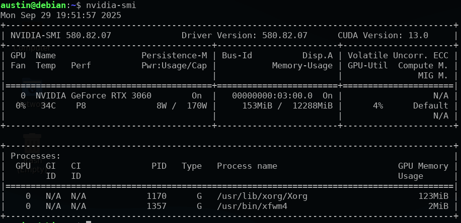

# Debian13 Nvidia Proprietary Driver install script

 - quick script to get latest proprietary drivers on a fresh debian13 install
 - mostly adapted from [nvidia documentation](https://docs.nvidia.com/datacenter/tesla/driver-installation-guide/#debian)
- there is only an install method officially for debian12
    - this does install the debian12 version, I have run it like this since shortly after trixie was released without issue, however since this is technically the debian12 driver it could break something in someway, if you make money with the computer in question, you probably shouldn't do this
- If the version of nvidia drivers are not pinned to 580 and a `sudo apt update && sudo apt upgrade -y` command is run, it will install drivers-590. Those drivers cause the system to be unusable. The script pins the drivers to 580.
- Additionally, if the Linux kernel is updated, the installed drivers are for the old kernel, and if you reboot into the new kernel, everything will be broken. The easy solution to this is to use the option 1 that I have integrated into the script. This runs the commands to rebuild the drivers for the new kernel so that when a user reboots into the new kernel (which will happen by default after a reboot) everything will continue to function properly without interruption.
    - (Obviously a user could just copy and paste those commands from the script if that better suits their needs)


## Quick Use

1. quick use
- copy and paste this in the terminal, press enter, enjoy

```bash
sudo wget -O - https://raw.githubusercontent.com/austinp0573/debian13_nvidia_drivers/main/debian13_nvidia_drivers.sh | bash
```

## Use by doing the steps manually

2. you can also clone the repo or manually use wget

 ```bash
 git clone https://github.com/austinp0573/debian13_nvidia_drivers.git
 ```

 ```bash
 wget https://raw.githubusercontent.com/austinp0573/debian13_nvidia_drivers/main/debian13_nvidia_drivers.sh
 ```

3. change permissions

```bash
sudo chmod +x debian13_nvidia_drivers
```

4. run it

```bash
./debian13_nvidia_drivers
```

## Tested & Working
- at least as of this moment, it works
- I use proprietary drivers and I do lots of fresh debian installs, so I will update this if it stops working.



## Update note
- Fixed issue with drivers-590.
- Put an option to overwrite, or not overwrite `/etc/apt/sources.list`.
- Added a brief option for an intro script to rebuild current drivers in the event of a Linux Kernel upgrade.

&nbsp;

**466f724a616e6574**